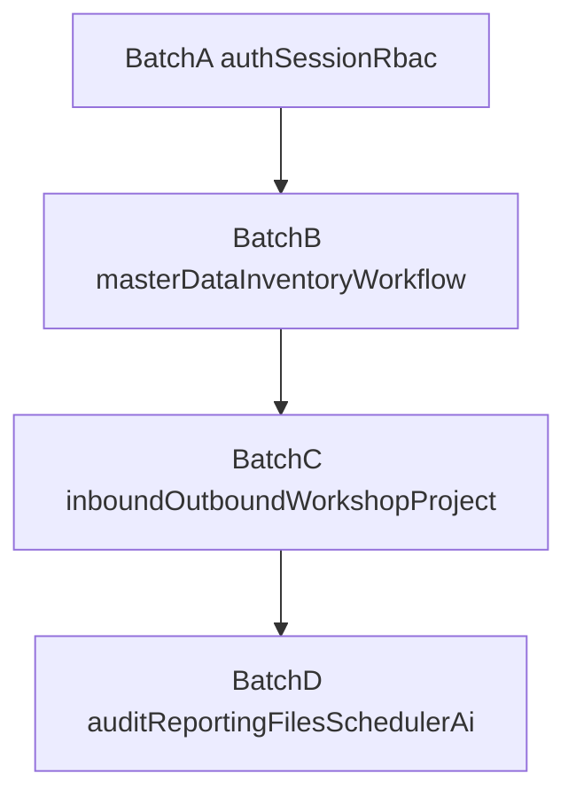

# Subagents 并行构建批次

## 0. 当前 Todo 状态

- [x] `批次 A`：已完成
- [ ] `批次 B`：下一步
- [ ] `批次 C`：未完成
- [ ] `批次 D`：未完成

## 1. 目标

在模块设计文档完成后，按照依赖层次而不是任意模块顺序启动 subagents，降低返工和跨模块接口漂移。

## 2. 前置条件

- `/docs/00-architecture-overview.md` 已确认
- 对应模块文档已完成并冻结边界
- 共享常量、状态码、单据类型码已在文档中显式列出
- 对于使用 raw SQL 的模块，关键查询已在文档中标注

## 3. 批次划分

### 批次 A：认证与权限底座

Todo 状态：已完成

- `auth`
- `session`
- `rbac`

前置条件：

- 全局异常、配置、Redis、JWT 基础设施准备完成
- 权限字符串命名规范确定

交付要求：

- 登录、退出、会话恢复、在线用户、路由树与权限集可闭环

### 批次 B：共享业务核心

Todo 状态：下一步

- `master-data`
- `inventory-core`
- `workflow`

前置条件：

- 批次 A 完成
- Prisma 与事务包装可用
- 审核状态、库存日志、来源追踪语义冻结

交付要求：

- 主数据 CRUD、库存增减与逆操作、审核记录服务可被其他模块复用

### 批次 C：事务型单据

Todo 状态：未完成

- `inbound`
- `outbound`
- `workshop-material`
- `project`

前置条件：

- 批次 B 完成
- `inventory-core` 提供稳定应用服务
- `workflow` 提供统一审核接口

交付要求：

- 单据主从表事务、库存副作用、审核重置、下游校验全部落地

### 批次 D：外围与增强能力

Todo 状态：未完成

- `audit-log`
- `reporting`
- `file-storage`
- `scheduler`
- `ai-assistant`

前置条件：

- A、B、C 至少完成核心接口
- 统计口径与审计事件格式已稳定

交付要求：

- 日志、报表、文件、任务、AI 编排可接入前面模块而不反向侵入领域边界

## 4. 推荐并行矩阵

## 5. 模块级前置依赖

- `auth` 依赖：`session`、`rbac`
- `session` 依赖：Redis、JWT
- `rbac` 依赖：用户/角色/菜单基础表、数据权限策略
- `master-data` 依赖：Prisma、字典查询
- `inventory-core` 依赖：`master-data`、事务服务、raw SQL 查询层
- `workflow` 依赖：`rbac`、共享审计字段
- `inbound` 依赖：`master-data`、`inventory-core`、`workflow`
- `outbound` 依赖：`master-data`、`inventory-core`、`workflow`
- `workshop-material` 依赖：`master-data`、`inventory-core`、`workflow`
- `project` 依赖：`master-data`、`inventory-core`
- `reporting` 依赖：`inventory-core`、`inbound`、`outbound`、`workshop-material`
- `audit-log` 依赖：认证事件、控制器拦截器
- `file-storage` 依赖：配置、静态资源映射
- `scheduler` 依赖：数据库任务表、执行器注册、日志表
- `ai-assistant` 依赖：`reporting`、`inventory-core`、`master-data`

## 6. 批次验收门槛

- 通用要求：所有批次提交前至少执行 `pnpm lint`；如需自动整理格式，执行 `pnpm format`
- 批次 A：完成 `auth/session/rbac` e2e 测试，并执行 `pnpm lint && pnpm test:e2e`
- 批次 B：完成库存与审核集成测试，并执行 `pnpm lint && pnpm test`
- 批次 C：完成单据流一致性测试，并执行 `pnpm lint && pnpm test`
- 批次 D：完成日志、报表、文件、任务、AI 接口联调，并执行 `pnpm lint && pnpm test`

## 7. 协作约束

- 每个 subagent 只能改动自己负责模块与共享契约文件
- 跨模块依赖必须通过文档中声明的接口调用
- 如需修改共享契约，先更新文档再重新分配批次
